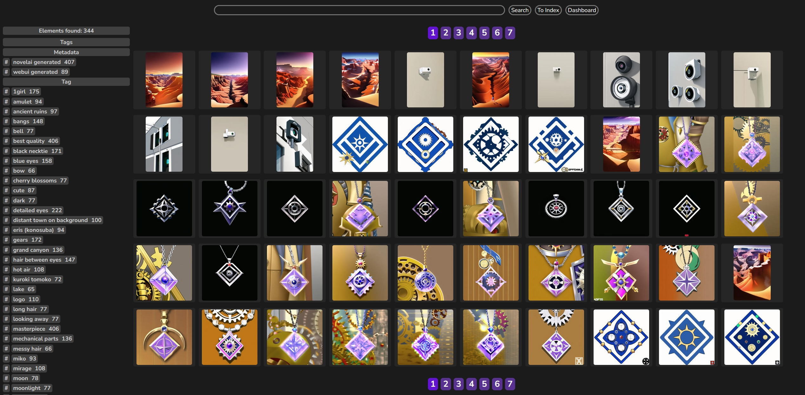
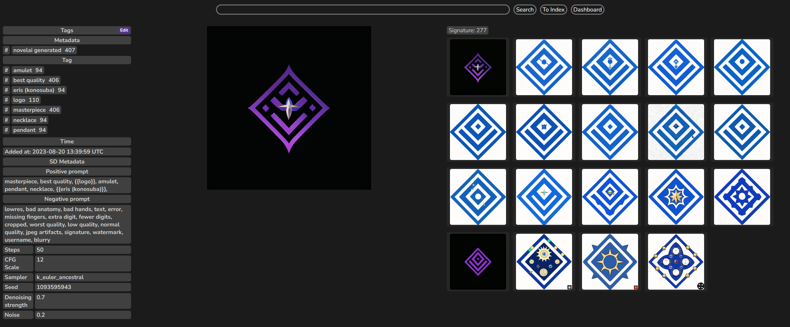
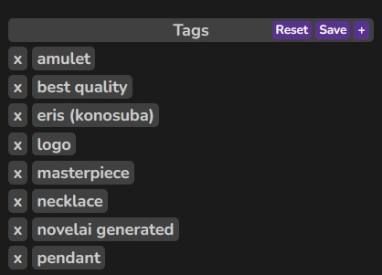
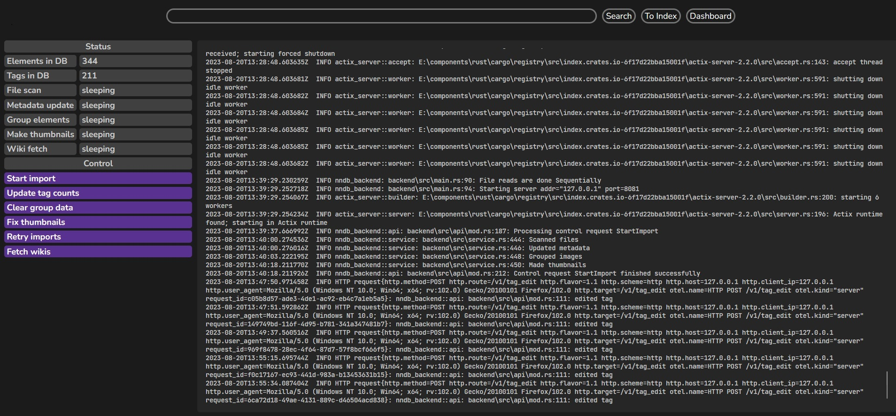
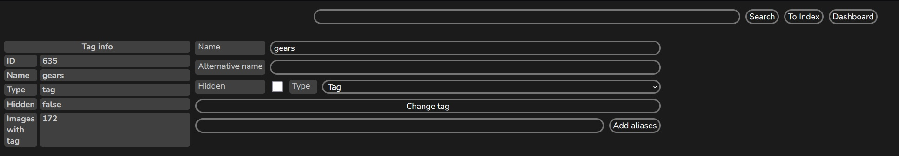
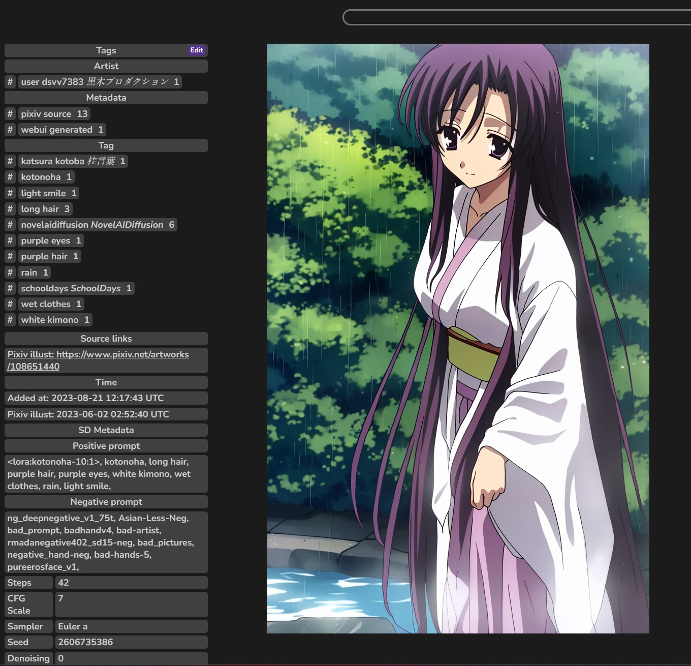

# nndb
Stable Diffusion output archiver and metadata parser, written entirely in Rust.

## Overview
This project intended to store images generated by Stable Diffusion, but can also
be general-purpose tagged imageboard. Interface resembles various *booru boards.

## Features
 - [Stable diffusion webui](https://github.com/AUTOMATIC1111/stable-diffusion-webui) metadata parsing
 - NovelAI metadata parsing
 - Deconstruction of prompts to tags
 - Search by tags (inclusion and exclusion)
 - Pixiv metadata fetcher (if image was downloaded from it 
 and it's original filename left unchanged)
 - Grouping images by similarity, generation seed and pixiv illust id
 - Thumbnail generation

## Installation
1. Get built distribution.
2. Packed distribution already has all needed options and folders:
   `input` for input files, `pool` for elements, `thumb` for thumbnails,
   and `static` with compiled backend files.
3. Tune config: `testing_mode`, `auto_scan_files`, `log_level`, etc.
4. Start backend with `nndb <path-to-config.toml>`.
5. If you haven't changed `host` and `port` options, open `http://127.0.0.1:8080/` in browser.
6. See [usage](#usage).

## Build
### Prerequisites:
- [Stable Rust toolchain](https://www.rust-lang.org/)
- [Trunk](https://yew.rs/docs/getting-started/introduction)
- [Rust Wasm target](https://yew.rs/docs/getting-started/introduction)
- [Just](https://github.com/casey/just/tree/master)

### Build process
- Windows
  - run `just pack` and built artifact will be in `dist` folder

## Development
Install [prerequisites](#prerequisites).

Install [`sqlx-cli`](https://github.com/launchbadge/sqlx/tree/main/sqlx-cli) and run following 
command to create development database
```
just create-dev-db
```

There are `justfile` with commands to run backend, serve frontend, and start editor (helix) 
with needed environment variables:

 - `DATABASE_URL` - needed by `sqlx` crate for compile-time checked SQL queries
 - `BACKEND_URL` - needed by `frontend` at build time to construct requests to `backend`


To run stack, you can open 2 terminals and execute `just run-back` and `just serve-front`
commands. Note that frontend is rebuilt automatically on changes, while backend is not.

## Usage
### Importing images
Copy/move generated images to configured `input_folder`. If you have `auto_scan_files` 
set to `true` in your config, files will be imported automatically after some time.
Otherwise you need to go to [Dashboard](#dashboard) and start import manually.
Depending on `testing_mode` option files will be copied to `element_pool` folder 
or just moved and renamed.
You can track importing progress in Dashboard.

### Index page


Index page displays list of found elements and this selection's most frequent tags.
Tags are splitted in categories and sorted in alphabet order.
Little hash `#` sign near tag name leads to [tag edit page](#tag-page).
A search by tag will be performed on tag name click.

### Using search
Search field provides tag autocompletion. Start typing and choose from drop-down list.
You can prefix tags with `!` to exclude them from selection. Search terms are separated with whitespace. 
A term is considered a meta-tag if it has `:` in it. 

There are currently only these meta-tags:
- `group:<integer>` - to include only images in this group (by similarity).
- `extgroup:<integer>` - to include only images in this group. While upper meta-tag only includes 
  images in groups formed by image similarity, this one uses groups from external sources 
  (pixiv `illust id` and stable diffusion `seed`).


### Element page


This page displays element, its metadata and associated elements. Metadata block displays
tags, time when this element was added to the database, and Stable diffusion parameters.

Element image is clickable and will expand to full size on click (and shrink back on another).
By default it is fitted to viewport.

There is also associtated elements block on this page. This block displays elements that have 
the same group IDs with this element. Different groups are separated by their headers.

There is little `Edit` button on tag block header. If it was pressed, tag block will switch to edit mode.


In this mode tags can be added or deleted from this element. `Reset` button will discard all changes,
`Save` will send tag change request to the backend and `+` will show tag input field.
Tag input field can accept multiple tags separated by whitespace. 


### Dashboard


Dashboard is a web ui page dedicated to control backend. It has following elements:
- Count of elements and tags in database. Not updated automatically.
- Service tasks status that updated automatically.
- Recent backend log that also updated automatically.
- Buttons to send control requests
  - Start import - manually starts import tasks
  - Update tag counts - most of the time tag counts should be in sync with elements,
    but if something gone wrong, this request will fix it.
  - Clear group data - removes all images groups formed by image similarity.
  - Fix thumbnails - checks thumbnails folder and generates missing thumbnails.
  - Retry imports - if there are imports (of pixiv metadata), that have been failed,
    retry them one more time.
  - Fetch wikis - fetch part of [`danbooru`](https://danbooru.donmai.us/tags?commit=Search&search%5Bhide_empty%5D=yes&search%5Border%5D=count) 
    tags database for tag types and aliases.
    **It is recommended to run this request before importing images**.


### Tag page


This page displays info about tag and form that allows to edit them.
You can change parameters and click `Change tag` to apply changes:
 - Name - unique primary name of the tag. 
 - Alternative name - second name of the tag. It may be not unique and contain any characters.
 - Type - type of the tag (Tag, Artist, Metadata, Character, Title).
 - Hidden - this boolean value determines if tag is hidden from search queries.
   This tag won't be autocompleted and images that has it are not shown by default.
   However, if this tag entered explicitly into search, this restrictions go away.

There is input field with autocompletion below the edit form. Here you can input tags that
will be added to alias group with this tag. When aliased tag is used in search, 
selection result will include not only elements with tag itself, but also elements with tag aliases.

### Pixiv metadata
You can extract your credentials using various projects like [this one](https://github.com/eggplants/get-pixivpy-token).

If config section `pixiv_credentials` is filled with valid credentials, additional metadata will be 
fetched from Pixiv for images with matching names:
```
Pixiv image regexes.
From pixiv web: 
"(\d+)_p\d+_master\d+": e.g. "108397938_p0_master1200.jpg"
From pixiv mobile:
illust_(\d+)_\d+_\d+: e.g. "illust_108651440_20230605_123207.png"
```




Note the tags with cursive japanese characters and a `Source links` metadata section. 
There is also a new entry in the `Time` section.

Pixiv metadata fetcher will try to write japanese tags without provided translations in romaji.
But if danbooru tag database was fetched before ([Dashboard](#dashboard)), 
these tags could be translated better using aliases from that db.